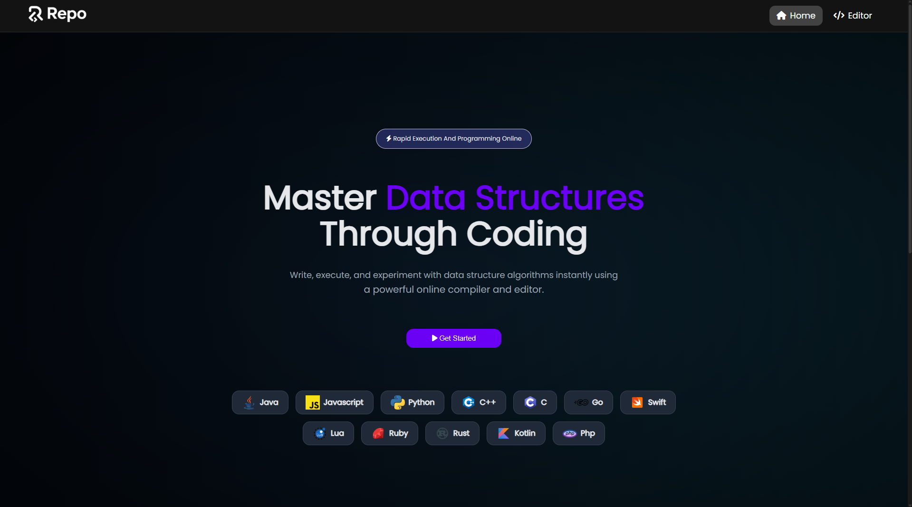
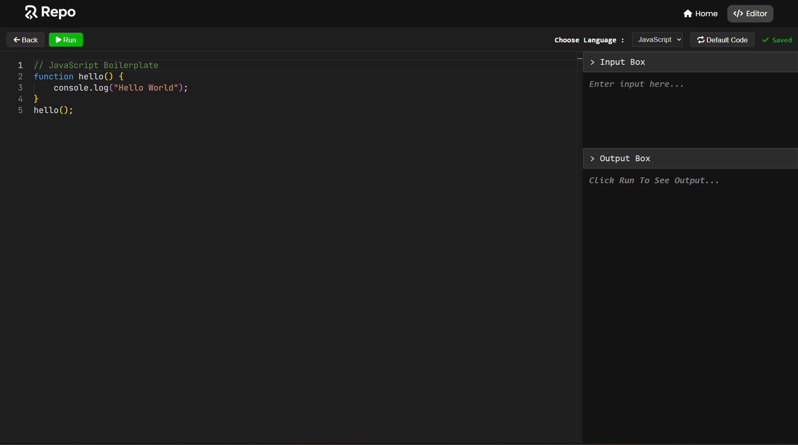

# Repo – Online Code Editor & Compiler

**Repo** is a modern, browser-based **online programming platform** designed to help students practice **data structures and algorithms** through real-time coding and execution. It provides a clean editor, multi-language support, and instant output — all without local setup.

---

## 📸 Project Screenshots

### Home / Landing Page

A focused landing experience encouraging users to start coding and master data structures.



### Online Code Editor

A powerful editor with language selection, input/output panels, and one-click execution.



---

## 🎯 Project Purpose

The objective of **Repo** is to:

* Provide an easy-to-use online compiler for beginners
* Help students practice **DSA concepts interactively**
* Remove the need for local compiler setup
* Offer a distraction-free coding environment

This project is ideal for **college students**, **DSA learners**, and **academic demos**.

---

## 🚀 Key Features

* Online code editor with syntax highlighting
* Multi-language support
* One-click code execution
* Input box for custom test cases
* Output console for results
* Default boilerplate code per language
* Clean and modern dark UI

---

## 💻 Supported Languages

* Java
* JavaScript
* Python
* C
* C++
* Go
* Swift
* Kotlin
* Rust
* Ruby
* Lua
* PHP

---

## 🛠️ Tech Stack

### Frontend

* React.js
* CSS / Tailwind CSS
* Monaco Editor / CodeMirror

### Backend *(Execution Engine)*

* Node.js
* Express.js
* Language-specific runtime environments

---

## 📂 Project Structure (Typical)

```
repo-online-compiler/
│
├── client/
│   ├── components/
│   ├── css/
│   ├── api.js/
│   └── App.jsx
│
├── screenshots/
├── README.md
└── package.json
```

---

## ▶️ How It Works

1. User selects a programming language
2. Default boilerplate code is loaded
3. User writes or edits code
4. Optional input is provided via Input Box
5. Click **Run** to execute
6. Output is displayed instantly

---

## 📈 Future Enhancements

* User authentication
* Save and share code snippets
* DSA problem sets & playlists
* Time and memory usage display
* Submission history
* Leaderboards

---

## 🎓 Target Audience

* Computer Science students
* DSA learners
* Coding practice platforms
* Academic project evaluations

---

## 📄 License

This project is developed for **educational purposes**. Free to use, modify, and extend.

---

## 🙌 Acknowledgements

* Open-source community
* React ecosystem
* Students and mentors contributing feedback
